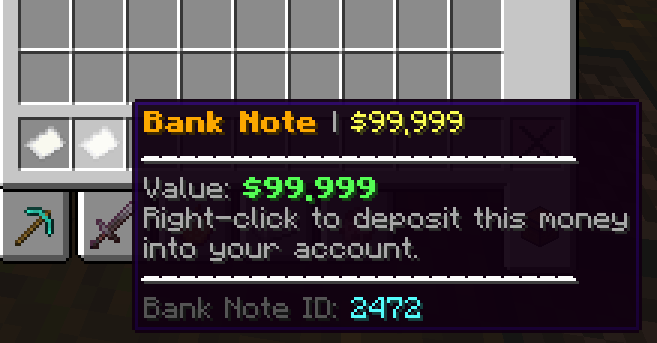
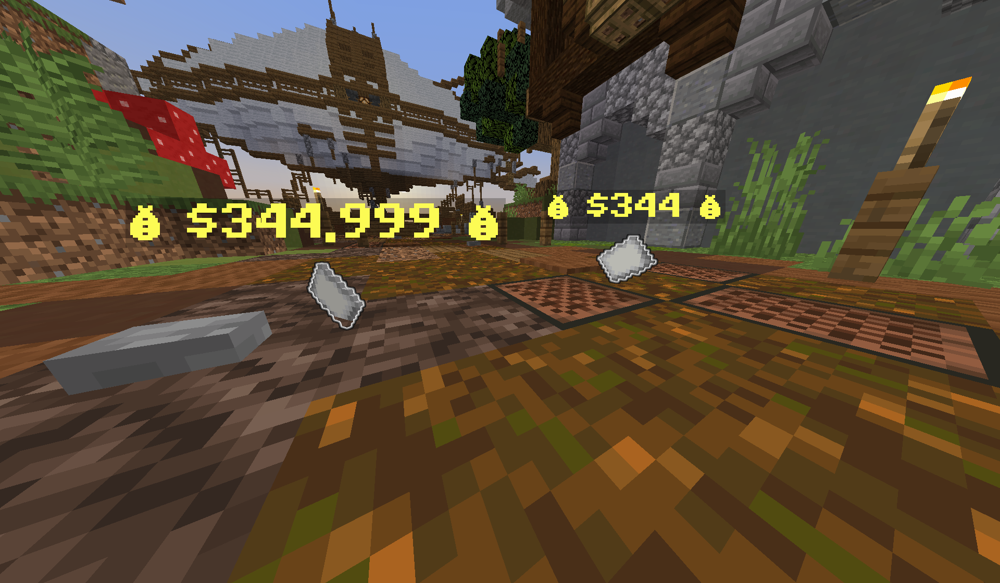

<p align="center">
  
</p>

# JustWithdraw

> **⚠️ This plugin requires [Vault](https://dev.bukkit.org/projects/vault) and a compatible economy plugin (such as EssentialsX) to function!**

<p align="center">
  
  
  
</p>

## Features

- Withdraw money as paper notes with `/withdraw <amount>`
- Right-click notes to deposit money back into your account
- Supports Vault economy

## Requirements

- Minecraft 1.21+ (Paper)
- [Vault](https://dev.bukkit.org/projects/vault)
- A compatible economy plugin (e.g., EssentialsX)

## Installation

1. Download the latest `JustWithdraw` jar from the [releases](#) (or build with Maven).
2. Place the jar in your server's `plugins` folder.
3. Make sure Vault and an economy plugin are installed.
4. Restart or reload your server.

## Usage

- `/withdraw <amount>`  
  Withdraws the specified amount as a bank note (paper item).
- `/withdraw`  
  Shows your current balance.
- `/withdraw reload`  
  Reloads the plugin configuration (requires `gitwithdraw.reload` permission).

### Example

- `/withdraw 1000`  
  Gives you a paper note worth 1000 currency units.

- Right-click the note to deposit the money back into your account.

## Permissions

| Permission           | Description                       | Default |
| -------------------- | --------------------------------- | ------- |
| `justwithdraw.use`   | Allows use of `/withdraw` command | true    |
| `gitwithdraw.reload` | Allows reloading the config       | op      |

## Configuration

Edit `plugins/JustWithdraw/config.yml` to customize:

- Message prefix
- Minimum withdraw amount
- Note display (name, glow, pickup delay, floating)
- Thank-you message

Example:

```yaml
message-prefix: "§6[JustWithdraw] §r"
min-withdraw-amount: 1.0
show-note:
  enabled: true
  name-format: "§e§l💰 %amount% 💰"
  glowing: true
  pickup-delay: 10
  floating: false
show-message:
  enabled: true
  thank-you-message: "§aThanks for using JustWithdraw banking services!"
```

## Support

- Issues & suggestions: [GitHub Issues](https://github.com/awiones/JustWithdraw/issues)
- Contribute: [Github Repo](https://github.com/awiones/JustWithdraw)

## License

MIT
